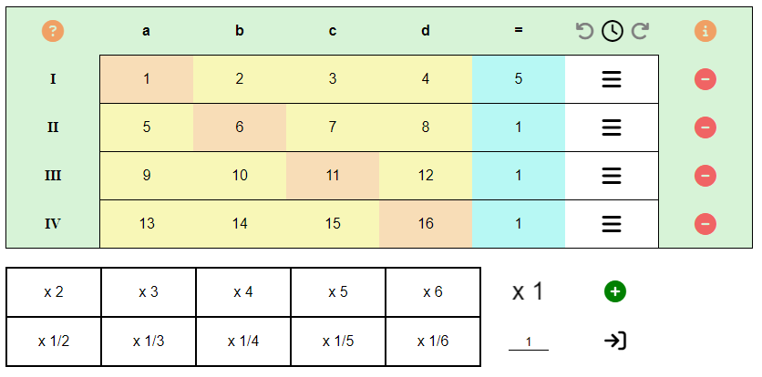

# Graphical Matrix Calculator
Hosted: https://devofvictory.github.io/graphical-matrix-calculator/

----

Version: `v1.2`
 
Developer: `DevOFVictory`
 
Date: `2022-11-12`

### About
This project is meant to make your calculations with matrices and the "Gauß Algorithmus" much easier. This is archived through a graphical interface and a history feature.

### Demo:

